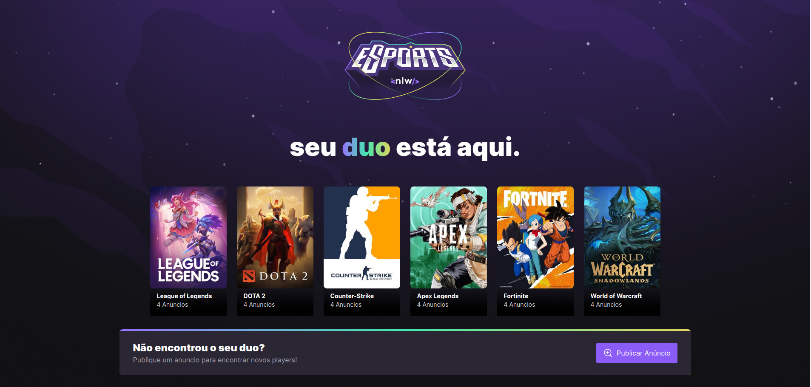

# NLW_Esports-Web

> Status: Developing ⚠️

<h2>Technologies Used: </h2>
<table>
    <tr>
    <td>HTML</td>
    <td>CSS</td>
    <td>TypeScript</td>
    <td>React</td>
    <td>Vite</td>
    <td>Tailwind</td>
    </tr>
</table>

<h2 align="center">Sobre 📖</h2>

   Esse projeto foi desenvolvido na Next Level Week eSports, em uma semana intensa de estudos, acompanhado de um projeto desenvolvido pela Rocketseat do dia 11 ao dia 18 de Setembro de 2022. 
   Essa aplicação consiste em um sistema Web e Mobile para encontrar dupla para jogar.  

---   

<h2 align="center">Tecnologias 🛠️</h2>

   

- [ReactJS](https://reactjs.org/)
- [TypeScript](https://www.typescriptlang.org)
- [TailWindCSS](https://tailwindcss.com)
- [React native](https://reactnative.dev/)
- [Expo](https://expo.dev/)
- [Prisma](https://www.prisma.io)

   

---
